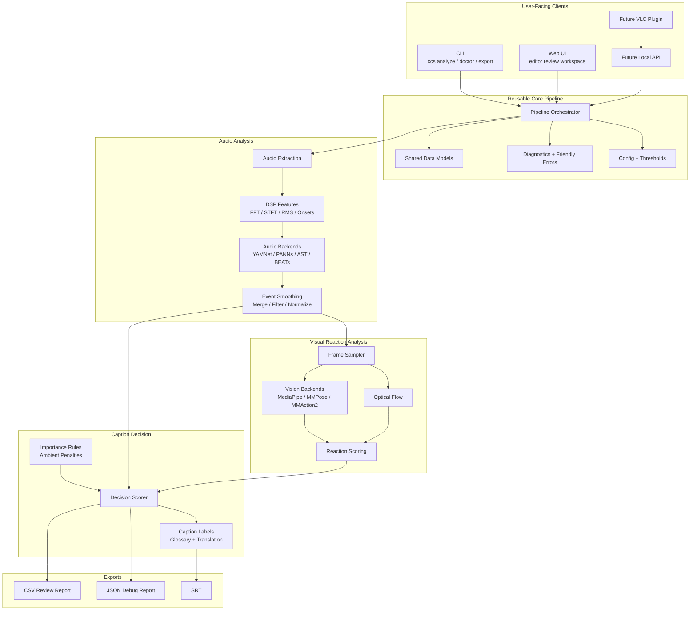
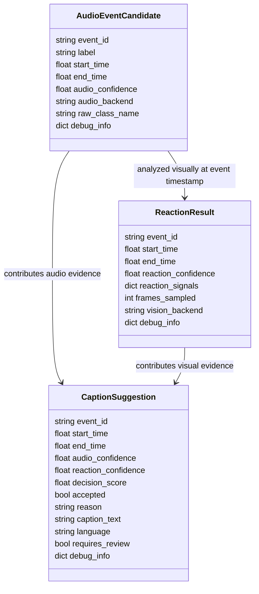
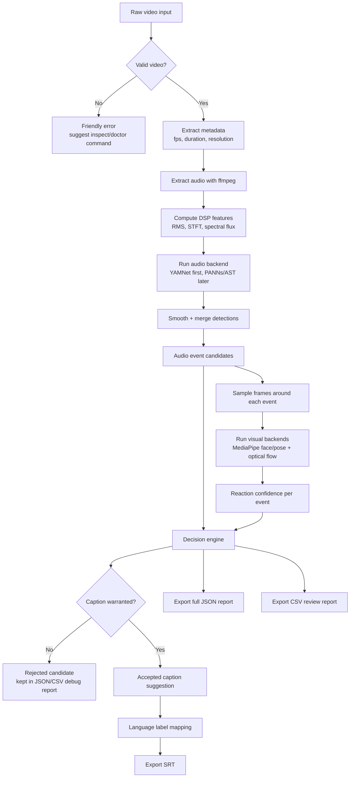
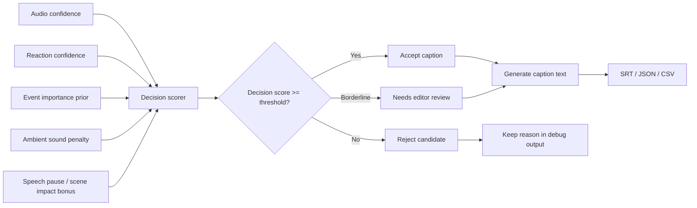
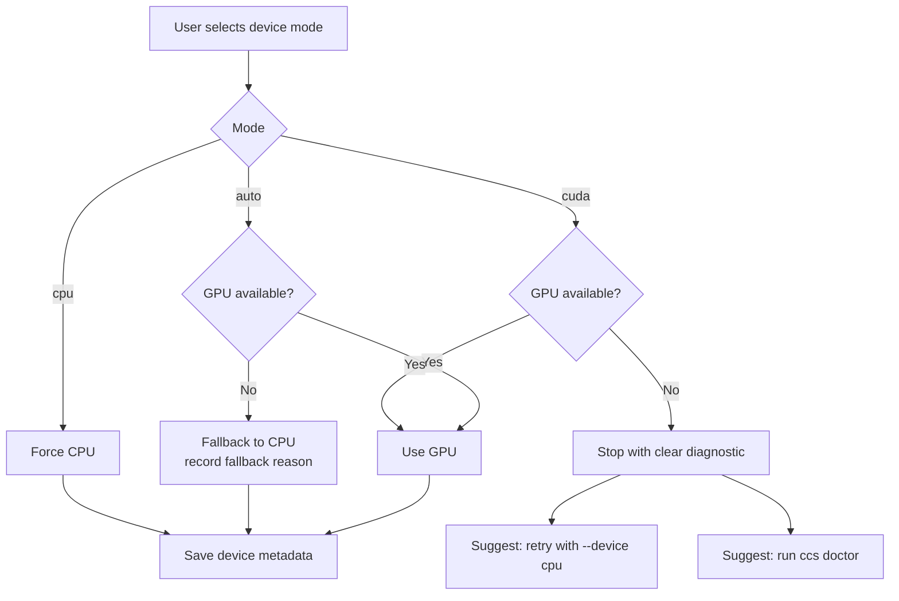
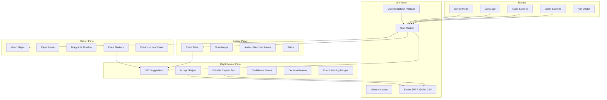
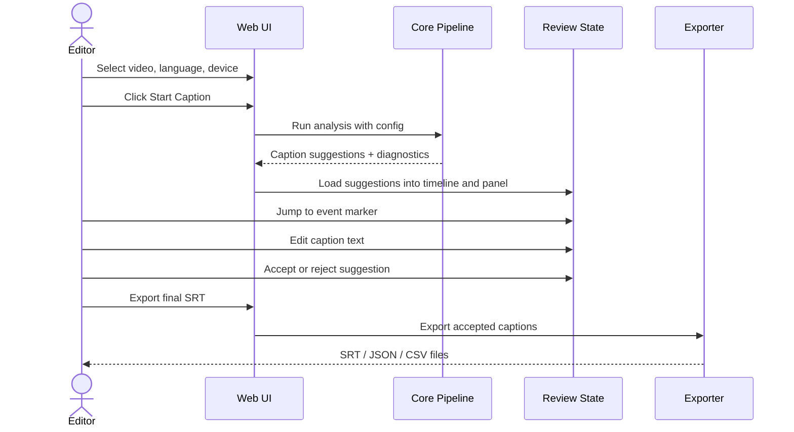
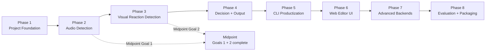

# Intelligent Closed Caption Suggestion Tool

An AI-powered Python backend and editor review tool for generating meaningful non-speech closed caption suggestions from raw video.

The project focuses on detecting moments where a non-speech sound meaningfully affects the scene, speaker, or narrative, then suggesting concise SRT captions such as `[horn honks]`, `[glass breaks]`, or `[crowd cheering]`. The goal is to assist accessibility editors without over-captioning routine, ambient, or low-impact sounds.

## Project Context

- **Product name:** Intelligent Closed Caption (CC) Suggestion Tool
- **Organisation:** Planet Read
- **Domain:** Education, accessibility, media tooling
- **Category:** Backend, Machine Learning, AI, Computer Vision
- **Primary users:** Accessibility editors, subtitling teams, content review teams
- **Initial content focus:** Hindi and Indian regional-language videos
- **Primary output:** SRT files containing only non-speech CC annotations

This project does not generate full dialogue subtitles in the first version. It analyzes raw videos and produces non-speech closed caption suggestions only.

## Implementation Status

The first runnable Python implementation has been started under [`main/`](main/). It includes the modular package, CLI, diagnostics, mock audio and vision backends, a CPU DSP audio backend, an OpenCV visual baseline, decision engine, multilingual caption labels, Streamlit UI client, and SRT/JSON/CSV exports.

Current scaffold commands:

```bash
cd main
python -m cc_suggester doctor
python -m cc_suggester analyze README.md --lang hi --device auto --out outputs
python -m cc_suggester labels
python -m pytest tests
```

The mock backends remain for deterministic tests, while `--audio-backend dsp` and `--vision-backend opencv` provide local real-processing baselines. YAMNet is wired as an optional TensorFlow Hub backend, and MediaPipe is wired as an optional pose-based reaction backend. PANNs, AST, BEATs, and richer MediaPipe face/expression scoring remain documented next steps in [`docs/implementation-plan.md`](docs/implementation-plan.md).

For environments without system ffmpeg, the sample generator can create an OpenCV video plus sidecar WAV file so the DSP/OpenCV path can still be tested locally.

## Interface Overview

### Web UI Editor Review Workspace

The Web UI is built as a modern editor workspace with **warm dark glassmorphism design** and full light/dark theme support. It features:

- **Interactive video player** with event markers and draggable timeline
- **Real-time review panel** for editing and accepting/rejecting captions
- **Multilingual support** with live caption label switching
- **Device & backend controls** for audio/vision model selection
- **Comprehensive event table** with all confidence scores and reasoning

#### Dark Mode (Default) — Hindi


The warm dark glassmorphism design features:
- Deep amber/charcoal background with warm gold accents
- Frosted glass panels with subtle warm-tinted borders
- Smooth theme toggle (☀/🌙) for light/dark switching

#### Multilingual Support

**Telugu:**


**Malayalam:**


Caption labels update live across all panels when language is changed.

#### Architecture & System Diagram


## Problem Statement

Accessibility editors currently add non-speech closed caption annotations by hand. This is time-consuming and requires judgment: not every sound should be captioned.

For example:

- A horn that causes a speaker to turn around may need `[horn honks]`.
- Constant background traffic may not need any caption.
- A glass breaking off-screen may need `[glass breaks]` if it affects the scene.
- Background music may not need a caption unless it is narratively important.

The tool should detect candidate sound events, inspect nearby visual reaction cues, decide whether the event is meaningful enough to caption, and export accepted suggestions into an SRT file.

## Goals

### Goal 1: Sound Event Detection Module

Automatically detect and classify non-speech audio events in a given video file with confidence scores and timestamps.

Expected behavior:

- Accept a video file as input.
- Extract the audio track.
- Run audio analysis using a pluggable sound event detection backend.
- Detect events such as honking, explosions, laughter, music, glass breaking, alarms, applause, door slams, phone rings, and crowd reactions.
- Produce timestamped audio event candidates with confidence scores.

Output example:

```json
{
  "event_id": "horn_honk",
  "label": "Horn honk",
  "start_time": 12.4,
  "end_time": 13.8,
  "audio_confidence": 0.87
}
```

### Goal 2: Speaker Reaction Detection Module

Detect visible speaker or scene reactions to audio events using visual analysis of video frames.

Expected behavior:

- For each detected audio event, sample video frames before, during, and after the event.
- Detect visual reaction cues such as:
  - head turn
  - sudden posture shift
  - startled body movement
  - facial expression change
  - mouth/eye/brow change
  - speech pause or freeze
  - scene-level movement spike
- Assign a reaction confidence score per event.
- Store visual analysis results alongside audio event data.

Output example:

```json
{
  "event_id": "horn_honk",
  "start_time": 12.4,
  "end_time": 13.8,
  "reaction_confidence": 0.71,
  "reaction_signals": {
    "head_turn": 0.82,
    "optical_flow_spike": 0.64,
    "facial_expression_change": 0.55
  }
}
```

### Goal 3: CC Decision Engine and SRT Output

Combine audio and visual signals to decide whether a caption is warranted, then export accepted captions to SRT.

Expected behavior:

- Combine audio confidence, visual reaction confidence, event importance, and ambient sound penalties.
- Reject low-impact ambient sounds.
- Generate short, editor-friendly CC labels.
- Export accepted captions to SRT.
- Export full debug results to JSON/CSV for review.

Example accepted SRT:

```srt
1
00:00:12,400 --> 00:00:13,800
[horn honks]

2
00:01:03,100 --> 00:01:04,600
[glass breaks]
```

## Midpoint Milestone

The midpoint milestone is completion of Goal 1 and Goal 2.

At midpoint, the project should demonstrate:

- CLI accepts a raw video input.
- Audio is extracted successfully.
- Non-speech sound events are detected with timestamps and confidence scores.
- Video frames are sampled around detected events.
- Visual reaction scores are computed and attached to each audio event.
- JSON debug output is generated.
- Basic SRT export may exist, but the final decision engine can still be simple.
- The pipeline runs on CPU and can optionally use GPU when available.
- The project is tested on a small sample set of Hindi and regional-language videos.

## Final Expected Outcome

The final project should provide:

- A Python-based backend pipeline.
- A command-line interface.
- A web-based editor review UI.
- Pluggable audio and vision model backends.
- CPU/GPU device selection and diagnostics.
- Multilingual non-speech CC label export.
- SRT export for accepted captions.
- JSON/CSV debug reports for all candidates.
- Documentation for installation, usage, troubleshooting, and contribution.

## Non-Goals for Version 1

The first version will not focus on:

- Full dialogue transcription.
- Full dialogue translation.
- Dubbing.
- Speaker diarization.
- Live real-time captioning.
- Perfect automatic caption approval without editor review.
- Training a custom large model from scratch.

These can become future extensions, but the core value is non-speech CC suggestion.

## Supported Languages

Version 1 should support caption label export in:

- English
- Hindi
- Tamil
- Telugu
- Bengali
- Marathi
- Malayalam

The default language is assumed to be the same language as the video. Since Version 1 only generates non-speech captions, default language handling can be simple:

- User selects the video language in CLI or UI.
- If language is not selected, default to English.
- Later, add automatic spoken-language detection.

Caption labels should be generated from a curated glossary first. Machine translation can be used later as a fallback, but editor-approved labels are safer because CC labels must be short, consistent, and natural.

Example:

| Event ID | English | Hindi |
| --- | --- | --- |
| `horn_honk` | `[horn honks]` | `[हॉर्न बजता है]` |
| `glass_break` | `[glass breaks]` | `[कांच टूटता है]` |
| `crowd_cheer` | `[crowd cheering]` | `[भीड़ जयकार करती है]` |

## High-Level Architecture

The project should be designed as reusable modules, not as logic embedded inside the CLI or Web UI.

```text
Core pipeline modules
  used by CLI
  used by Web UI
  later used by VLC plugin, API, or desktop app
```

The diagrams below use Mermaid, which renders directly in GitHub and many Markdown viewers.



Recommended repository structure:

```text
cc-suggester/
  cc_suggester/
    core/
      pipeline.py
      config.py
      diagnostics.py
      errors.py
      types.py

    audio/
      extractor.py
      dsp.py
      vad.py
      events.py
      backends/
        base.py
        yamnet.py
        panns.py
        ast.py
        beats.py

    vision/
      frame_sampler.py
      optical_flow.py
      reactions.py
      backends/
        base.py
        mediapipe_face.py
        mediapipe_pose.py
        mmaction.py

    decision/
      scorer.py
      rules.py
      labels.py

    output/
      srt.py
      json_report.py
      csv_report.py

    translation/
      glossary.py
      indictrans.py

    cli/
      app.py

    ui/
      streamlit_app.py

  configs/
    default.yaml
    cpu.yaml
    gpu.yaml

  label_maps/
    events.en.json
    events.hi.json
    events.ta.json
    events.te.json
    events.bn.json
    events.mr.json
    events.ml.json

  docs/
    architecture.md
    cli.md
    web-ui.md
    models.md
    troubleshooting.md
    evaluation.md
    vlc-plugin.md

  examples/
    README.md

  tests/
    unit/
    integration/

  requirements.txt
  requirements-ui.txt
  requirements-dev.txt
  requirements-translate.txt
  README.md
  CONTRIBUTING.md
  LICENSE
```

The exact file names can change during implementation, but the separation of responsibilities should remain.

## Data Model

The pipeline should pass structured objects between modules.

### Audio Event Candidate

Represents a detected sound event before visual analysis.

Fields:

- `event_id`
- `label`
- `start_time`
- `end_time`
- `audio_confidence`
- `audio_backend`
- `raw_class_name`
- `debug_info`

### Reaction Result

Represents visual reaction evidence for an audio event.

Fields:

- `event_id`
- `start_time`
- `end_time`
- `reaction_confidence`
- `reaction_signals`
- `frames_sampled`
- `vision_backend`
- `debug_info`

### Caption Suggestion

Represents the final decision.

Fields:

- `event_id`
- `start_time`
- `end_time`
- `audio_confidence`
- `reaction_confidence`
- `decision_score`
- `accepted`
- `reason`
- `caption_text`
- `language`
- `requires_review`
- `debug_info`

This structure allows the same result to be used by:

- CLI output
- Web UI review panel
- SRT export
- JSON report
- CSV report
- future VLC integration



## Pipeline Flow

```text
Input video
  -> validate input
  -> extract metadata
  -> extract audio
  -> run DSP candidate detection
  -> run sound event model backend
  -> merge and smooth audio events
  -> sample frames around event timestamps
  -> run visual reaction analysis
  -> combine audio and visual signals
  -> generate caption suggestions
  -> export SRT, JSON, CSV
```



## Audio Module Plan

The audio module should combine explainable signal processing with model-based classification.

### DSP Baseline

Use lightweight mathematical features to find candidate regions and explain event salience:

- RMS energy
- short-time Fourier transform
- log-mel spectrogram
- spectral flux
- onset strength
- zero-crossing rate
- peak detection
- duration filtering

This layer is useful because it is:

- fast
- CPU-friendly
- explainable
- helpful for debugging model outputs

However, DSP should not be the final classifier. It can identify that something happened, but not reliably classify what happened.

### Model Backends

Recommended backend priority:

1. **YAMNet** as the first baseline.
2. **PANNs** as a stronger optional backend.
3. **AST** for transformer-based audio classification experiments.
4. **BEATs** for advanced audio representation experiments.
5. **CLAP** later for open-vocabulary event matching.

The backend interface should stay stable:

```text
detect(audio_path, config) -> list of audio events
```

### Event Smoothing

Raw model outputs should be post-processed:

- merge adjacent detections of the same event
- remove very short low-confidence events
- suppress speech-like classes unless desired
- suppress constant ambient sounds
- normalize model labels into project event IDs

Example:

```text
Raw model labels:
  Vehicle horn, car horn, honking

Normalized event ID:
  horn_honk
```

## Vision Module Plan

The vision module should detect whether people or the scene visibly react to an audio event.

### Frame Sampling

For each audio event, sample frames from:

- before the event
- during the event
- after the event

Example:

```text
event_start - 1.0s
event_start - 0.5s
event_start
event_midpoint
event_end
event_end + 0.5s
event_end + 1.0s
```

### Reaction Signals

The reaction score can combine:

- head turn magnitude
- pose shift magnitude
- sudden optical flow spike
- facial expression change
- mouth open or close change
- eye/brow movement
- speaker pause proxy
- scene movement spike

### First Backend

Use:

- OpenCV for frame extraction and optical flow.
- MediaPipe Face Landmarker for facial landmarks and expression blendshapes.
- MediaPipe Pose Landmarker for body and head movement.

This is suitable for the midpoint because it is interpretable and can run on CPU.

### Future Backends

Potential later backends:

- MMPose for stronger pose estimation.
- MMAction2 for action recognition.
- Video-language models for heavier scene reasoning.

These should remain optional because they may be GPU-heavy.

## Decision Engine Plan

The decision engine decides whether a sound event deserves a caption.

A simple scoring formula:

```text
decision_score =
  audio_confidence
  + reaction_confidence
  + event_importance_prior
  + speech_pause_bonus
  - ambient_penalty
```

Example rules:

- Caption high-impact events even if reaction is weak:
  - gunshot
  - explosion
  - alarm
  - siren
  - glass breaking
- Require reaction or high confidence for common events:
  - horn
  - door slam
  - phone ring
  - applause
- Usually reject ambient continuous sounds:
  - fan noise
  - traffic hum
  - low background music
  - crowd murmur

Every decision should include a human-readable reason.

Example:

```text
Accepted because the audio model detected horn_honk with high confidence and the speaker turned their head immediately after the event.
```

Example rejection:

```text
Rejected because traffic noise was continuous, low-confidence, and no visible reaction was detected.
```



## CLI Plan

The CLI should be useful for developers, batch processing, debugging, and reviewers who prefer terminal workflows.

Recommended command shape:

```bash
ccs analyze input.mp4 --lang hi --device auto
ccs analyze input.mp4 --audio-backend yamnet --vision-backend mediapipe --out outputs/
ccs inspect input.mp4
ccs doctor
ccs export outputs/result.json --format srt --lang ta
ccs web
```

### CLI Commands

| Command | Purpose |
| --- | --- |
| `ccs analyze` | Run full pipeline on a video |
| `ccs audio` | Run only sound event detection |
| `ccs vision` | Run visual reaction analysis from existing audio events |
| `ccs export` | Convert JSON results to SRT/CSV |
| `ccs inspect` | Show video metadata and input validity |
| `ccs doctor` | Check environment, ffmpeg, models, CPU/GPU |
| `ccs web` | Launch the Web UI |

### CLI Error Suggestions

The CLI should explain errors and suggest next steps.

Wrong command example:

```text
No such command: analize
Did you mean: analyze?

Try:
  ccs analyze input.mp4 --device auto --lang hi
```

Missing video example:

```text
Input file was not found:
  videos/sample.mp4

Suggestions:
1. Check the path.
2. Run:
   ccs inspect /path/to/video.mp4
```

GPU failure example:

```text
CUDA was requested, but no usable GPU was detected.

Detected:
- torch.cuda.is_available(): false
- CUDA runtime: not found
- NVIDIA driver: not found

Suggestions:
1. Retry on CPU:
   ccs analyze input.mp4 --device cpu

2. Check environment:
   ccs doctor

3. Install a CUDA-compatible PyTorch build if GPU acceleration is required.
```

## Device Handling

The project should support:

```text
device = auto | cpu | cuda
```

Behavior:

- `auto`: use GPU if available, otherwise CPU.
- `cpu`: force CPU.
- `cuda`: require GPU; fail clearly if unavailable.

Each run should save device metadata:

- selected device
- actual device used
- model backend
- GPU name if available
- CUDA availability
- runtime
- fallback reason if CPU was used

The UI should provide:

- Auto/CPU/GPU toggle
- GPU diagnostics popup
- Retry on CPU button
- Copy diagnostic report button



## Web UI Plan

The Web UI should be an editor review workspace, not a basic demo.

Recommended initial framework:

- Streamlit for the first implementation because it is fast to build and supports video display.
- Later, consider React/FastAPI if the UI needs more advanced timeline editing.

### UI Layout

```text
Top Bar
  Product name
  Device mode selector
  Language selector
  Audio backend selector
  Vision backend selector
  Run Doctor button

Left Panel
  Video dropdown/upload
  Video metadata
  Start Caption button
  Export SRT button
  Export JSON button
  Export CSV button

Center Panel
  Video player
  Play/Pause controls
  Current timestamp
  Draggable timeline
  Event markers
  Previous/Next event buttons

Right Panel
  Review SRT suggestions
  Caption text editor
  Accept/Reject toggle
  Confidence scores
  Decision reason
  Warning/error badges

Bottom Panel
  Event table
  Start/end timestamps
  Event labels
  Audio confidence
  Reaction confidence
  Decision score
  Status
```



### Timeline Behavior

The timeline should show event markers:

- Green: accepted caption
- Yellow: needs review
- Gray: rejected
- Blue: currently selected event

Clicking a marker should:

- seek the video to that timestamp
- open the suggestion in the right review panel
- highlight the corresponding event table row

### Editor Review Flow

1. User selects or uploads a video.
2. User selects language and device mode.
3. User clicks **Start Caption**.
4. Pipeline generates caption suggestions.
5. User reviews suggestions in the right panel.
6. User edits captions if needed.
7. User accepts or rejects suggestions.
8. User exports final SRT.



### UI Error Handling

The UI should include:

- toast notifications for recoverable errors
- modal popups for blocking errors
- expandable debug details
- retry on CPU button when GPU fails
- model download/setup hints
- export success messages

## Output Files

Each run should produce a run directory:

```text
outputs/
  sample-video/
    captions.en.srt
    captions.hi.srt
    results.json
    events.csv
    diagnostics.json
    config.yaml
```

### SRT

Only accepted caption suggestions.

### JSON

Full structured output:

- accepted suggestions
- rejected candidates
- confidence scores
- reaction signals
- decision reasons
- diagnostics

### CSV

Reviewer-friendly table for spreadsheets.

## Installation Plan

Start with requirements files:

```text
requirements.txt
requirements-ui.txt
requirements-dev.txt
requirements-translate.txt
```

Recommended split:

- `requirements.txt`: core CPU pipeline
- `requirements-ui.txt`: Streamlit/Web UI
- `requirements-dev.txt`: test, lint, formatting, docs
- `requirements-translate.txt`: IndicTrans2 or translation extras

Example install flow:

```bash
python -m venv .venv
source .venv/bin/activate
pip install -r requirements.txt
pip install -r requirements-ui.txt
ccs doctor
```

GPU installation should be documented separately because CUDA-compatible PyTorch/TensorFlow installation depends on the user's system.

Docker should be added later for reproducibility, but requirements files are easier for first-time contributors.

## Configuration Plan

Use YAML config files for reproducible runs.

Example settings:

```yaml
device: auto
language: en
audio_backend: yamnet
vision_backend: mediapipe
audio_threshold: 0.45
reaction_threshold: 0.35
decision_threshold: 0.65
min_event_duration: 0.25
merge_gap: 0.40
sample_window_before: 1.0
sample_window_after: 1.0
```

CLI flags should override config values.

## Evaluation Plan

The tool should be evaluated on a small sample set of Hindi and regional-language content.

### Suggested Evaluation Data

Initial languages:

- Hindi
- Tamil
- Telugu
- Bengali
- Marathi
- Malayalam

Video types:

- educational videos
- conversational scenes
- public-service clips
- classroom-style videos
- documentary-style clips

### Annotation Process

Editors should review:

- whether the suggested caption is needed
- whether the label is correct
- whether the timestamp is correct
- whether any important sound was missed
- whether any unnecessary sound was captioned

### Metrics

Track:

- audio event precision
- audio event recall
- caption decision precision
- over-captioning rate
- missed-important-event rate
- timestamp quality
- editor acceptance rate
- average editor correction time

### Feedback Fields

Suggested review CSV columns:

```text
video_id
event_id
start_time
end_time
caption_text
audio_confidence
reaction_confidence
decision_score
accepted_by_tool
accepted_by_editor
editor_corrected_label
editor_notes
```

## VLC Plugin Plan

VLC integration is a useful extension, but it should not be part of the midpoint.

Recommended phases:

1. Generate SRT externally and let users load it in VLC.
2. Add a helper command that analyzes the current video path.
3. Build a VLC Lua extension that calls the local CLI or local API.
4. Let the extension load the generated SRT when analysis finishes.

The VLC plugin should use the same core modules indirectly through CLI/API, not duplicate analysis logic.

## Roadmap

### Phase 1: Project Foundation

- Define module interfaces.
- Create data models.
- Add config system.
- Add diagnostics and friendly errors.
- Add README and project documentation.

### Phase 2: Goal 1 Audio Detection

- Extract audio with ffmpeg.
- Add DSP baseline.
- Add YAMNet backend.
- Add event smoothing and label normalization.
- Export audio event JSON.

### Phase 3: Goal 2 Visual Reaction Detection

- Sample event-aligned frames.
- Add OpenCV optical flow features.
- Add MediaPipe face/pose backends.
- Compute reaction confidence.
- Attach reaction data to audio events.

### Phase 4: Goal 3 Decision and Output

- Add decision scorer.
- Add event importance rules.
- Add ambient rejection logic.
- Add SRT/JSON/CSV export.
- Add multilingual caption label glossary.

### Phase 5: CLI Productization

- Add complete CLI commands.
- Add typo suggestions.
- Add error recovery suggestions.
- Add `doctor` diagnostics.
- Add CPU/GPU fallback behavior.

### Phase 6: Web Editor Review UI

- Add video selector/upload.
- Add Start Caption button.
- Add review panel.
- Add timeline event markers.
- Add accept/reject/edit flow.
- Add export buttons.
- Add error popups and diagnostics panel.

### Phase 7: Advanced Backends

- Add PANNs backend.
- Add AST or BEATs backend.
- Add optional translation backend.
- Add stronger visual backends if needed.

### Phase 8: Evaluation and Packaging

- Evaluate on Hindi and regional-language videos.
- Collect editor feedback.
- Improve thresholds and label glossary.
- Add Docker.
- Add VLC integration prototype.



## Open Questions

- Should caption labels be formal, conversational, or broadcaster-style in each language?
- Should laughter be treated as speech-adjacent or non-speech for this project?
- Should music be captioned only when it begins/stops or changes mood?
- How should overlapping non-speech events be represented in SRT?
- What timestamp tolerance is acceptable for editors?
- Will sample videos be provided with editor-approved ground truth?
- Should the Web UI support manual timestamp adjustment in Version 1?
- Should rejected events be shown by default or hidden under debug/review mode?

## Contribution Guidelines

Contributors should follow these principles:

- Keep backend logic independent from UI.
- Add new models through backend interfaces.
- Preserve JSON output compatibility where possible.
- Include tests for decision rules and output formatting.
- Prefer readable, debuggable logic over opaque automation.
- Avoid over-captioning as a core product principle.
- Document new event labels in the multilingual glossary.

## Proposed Tech Stack

Core:

- Python
- ffmpeg
- OpenCV
- NumPy
- SciPy/librosa-style audio features
- PyTorch and/or TensorFlow depending on model backend

Audio:

- DSP baseline
- YAMNet
- PANNs
- AST or BEATs as optional advanced backends

Vision:

- OpenCV
- MediaPipe Face Landmarker
- MediaPipe Pose Landmarker
- optional MMPose/MMAction2 later

CLI:

- Typer
- Rich

Web UI:

- Streamlit first
- optional FastAPI/React later

Translation:

- curated glossary first
- IndicTrans2 fallback later

Testing:

- pytest
- small synthetic fixtures
- sample video integration tests

## Success Criteria

The project is successful when:

- It accepts raw videos without subtitles or transcripts.
- It detects non-speech audio events with timestamps.
- It estimates visible reaction confidence around each event.
- It avoids captioning low-impact ambient sounds.
- It exports clean SRT files.
- It provides useful debug information.
- It runs on CPU and can use GPU when available.
- It lets editors review, edit, accept, reject, and export suggestions.
- It supports English plus initial Indian regional-language caption labels.

## Summary

This project should be built as a modular open-source tool:

- The backend pipeline does the real work.
- The CLI provides batch and debug workflows.
- The Web UI provides editor review and export workflows.
- Future VLC or API integrations reuse the same modules.

The first implementation should prioritize a reliable, explainable pipeline using DSP, YAMNet, OpenCV, MediaPipe, and a rule-based decision engine. Stronger audio/video models can be added later through the pluggable backend system.
# Intelligent-Closed-Caption-CC-Suggestion-Tool
